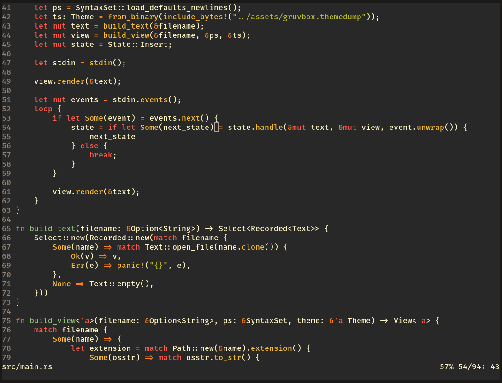

<h1 align="center">
  <a href="https://github.com/IGI-111/Smith">
  
  </a>
</h1>

Smith is a simple terminal-based text editor written in Rust.

## Install

Using Cargo:
```
cargo install smith
```

## Features

* line numbers
* undo/redo
* standard keybindings (Ctrl-S, Ctrl-Z, Ctrl-C, Esc...)
* mouse support
* clipboard support

With more planned such as syntax highlighting, user configurations, search & replace, persistent undo, etc.

Here's what it looks like editing its own source code:

<h2 align="center">
  
</h2>
